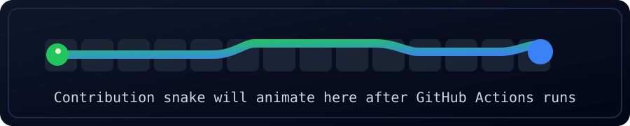

<table width="100%">
  <tr>
    <td valign="top">
      
        
      
    </td>
  </tr>
</table>

### Language Effect

### Contribution Snake

<picture>
  <source media="(prefers-color-scheme: dark)" srcset="https://raw.githubusercontent.com/Paras-VPatil/Paras-VPatil/output/github-contribution-grid-snake-dark.svg" />
  <source media="(prefers-color-scheme: light)" srcset="https://raw.githubusercontent.com/Paras-VPatil/Paras-VPatil/output/github-contribution-grid-snake.svg" />
  
</picture>

### Tech Stack

