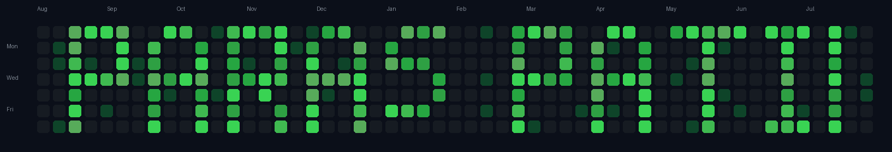

<!-- Top Banner: GitHub Contribution Heatmap with Name -->

<picture>
  <source media="(prefers-color-scheme: dark)" srcset="./assets/contribution-grid-paras-patil-dark.svg" />
  <source media="(prefers-color-scheme: light)" srcset="./assets/contribution-grid-paras-patil-light.svg" />
  
</picture>

 

<!-- Profile Header -->
<table width="100%">
  <tr>
    <td width="30%" align="center">
      
    </td>
    <td width="70%">
      <h1>Hi, I'm Paras Patil 👋</h1>
      
        
      

        🎓 Exploring AI, Data Science &amp; Full-Stack Development 
        🛠️ Currently building projects around ML-driven tools and web apps 
        🌱 Always learning something new — one commit at a time
      

      

        
        
        
      

    </td>
  </tr>
</table>

 

<!-- 📊 GitHub Stats Section -->
## 📊 GitHub Stats

  

  

 

<!-- 🛠️ Tools & Tech Section -->
## 🛠️ Tools &amp; Tech

 

<!-- 🎮 Contribution Games & Animations Section -->
## 🎮 Contribution Games &amp; Animations

<!-- 🐍 Snake Game Animation -->
<picture>
  <source media="(prefers-color-scheme: dark)" srcset="https://raw.githubusercontent.com/Paras-VPatil/Paras-VPatil/output-snake/github-contribution-grid-snake-dark.svg" />
  <source media="(prefers-color-scheme: light)" srcset="https://raw.githubusercontent.com/Paras-VPatil/Paras-VPatil/output-snake/github-contribution-grid-snake.svg" />
  
</picture>

  

<!-- 🕹️ Pacman Game Animation -->
<picture>
  <source media="(prefers-color-scheme: dark)" srcset="https://raw.githubusercontent.com/Paras-VPatil/Paras-VPatil/output-pacman/pacman-contribution-graph-dark.svg" />
  <source media="(prefers-color-scheme: light)" srcset="https://raw.githubusercontent.com/Paras-VPatil/Paras-VPatil/output-pacman/pacman-contribution-graph.svg" />
  
</picture>

  

<!-- 🚀 Space Shooter / Jet Game Animation -->

 

⭐️ Thanks for stopping by — feel free to explore my repositories and connect!

